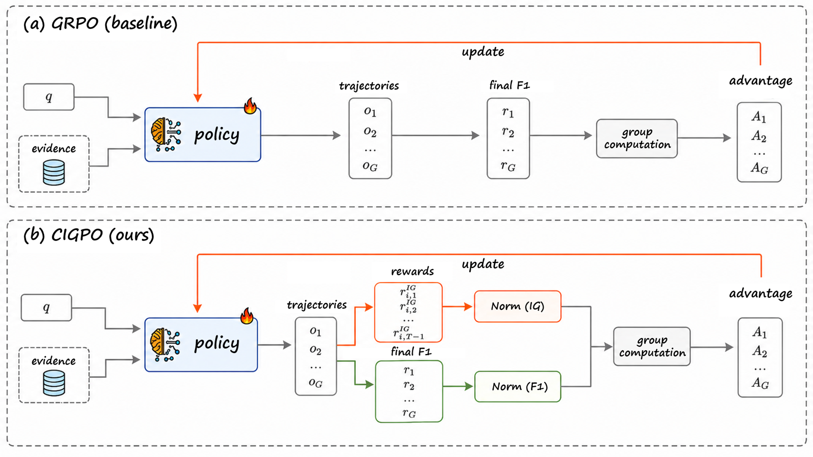
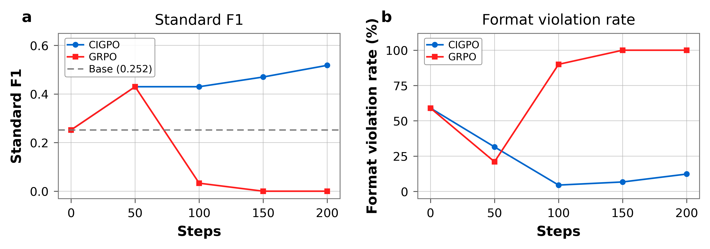
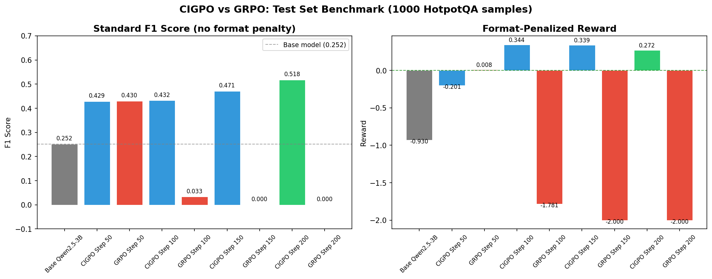
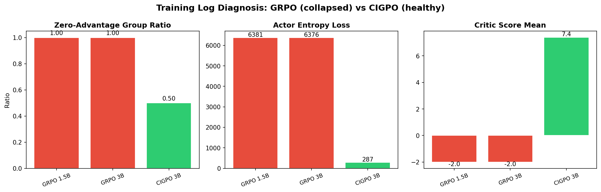
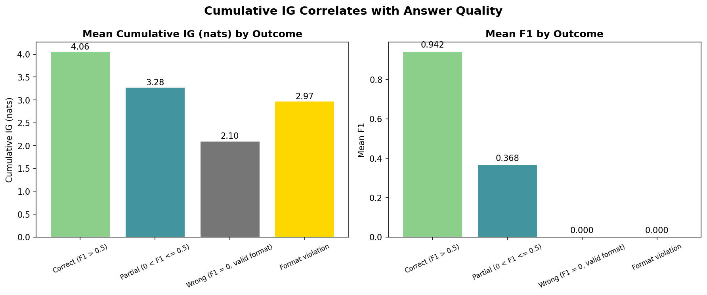

# CIGPO：基于上下文信息增益的策略优化

[](https://doi.org/10.5281/zenodo.21097914)

**CIGPO (Contextual Information-Gain Policy Optimization)** 是一种方差注入框架，
通过逐轮信息增益信用分配，防止多轮证据阅读 LLM 智能体的 GRPO 训练崩溃。

> **技术报告**：[`paper/CIGPO_technical_report.pdf`](paper/CIGPO_technical_report.pdf)
> **完整代码与训练日志**：[Zenodo 10.5281/zenodo.21097914](https://doi.org/10.5281/zenodo.21097914)

---

## 问题：GRPO 为何崩溃？

GRPO 在同一问题的多个 rollout 之间做组内归一化：`A_i = (R_i - mean(R)) / std(R)`。

多轮证据阅读场景中，正确答案信号（F1）只在最终答案处出现。中间轮次长期处于**零优势方差死锁**——所有 rollout 得分相同，优势为 0，策略梯度消失，模型退化为 100% 格式违规输出。

## CIGPO 方案

CIGPO 通过三个组件打破死锁：

<table>
<tr><th>组件</th><th>角色</th><th>机制</th></tr>
<tr><td><b>IG 奖励</b></td><td>信号来源</td><td>每轮信息增益：<code>log p(y* | q, e_≤t) − log p(y* | q, e_&lt;t)</code></td></tr>
<tr><td><b>分离归一化</b></td><td>信号保存</td><td>IG 与 F1 在组内独立归一化</td></tr>
<tr><td><b>课程学习</b></td><td>信号调度</td><td>IG 权重 0.1 → 0.3 线性增加</td></tr>
</table>

## 核心结果

| 方法 | 正确 (1.0) | 格式违规 (-2.0) | F1 (测试集) |
|------|-----------|----------------|------------|
| **CIGPO** | **48.0%** | **19.0%** | **0.518** |
| GRPO | 14.0% | 69.0% | 0.000 (崩溃) |

CIGPO F1 相对基座模型提升 **+105%**（0.252 → 0.518）。详细结果见 [`results/main_results.md`](results/main_results.md)。

## 架构



## 训练动态



## 基准测试



## 训练日志诊断



## 累积 IG 与答案质量



---

## 仓库内容

| 路径 | 说明 |
|------|------|
| `paper/CIGPO_technical_report.pdf` | 技术报告 |
| `figures/` | 论文图表（架构、训练曲线、基准、诊断、累积 IG） |
| `results/main_results.md` | 完整实验结果与配置 |
| `CITATION.cff` | 标准引用元数据 |
| `LICENSE` | MIT |

> 完整源代码、训练脚本、VERL 补丁及训练日志已归档至 Zenodo：[10.5281/zenodo.21097914](https://doi.org/10.5281/zenodo.21097914)

---

## 引用

```bibtex
@software{dou2026cigpo,
  title     = {CIGPO: Contextual Information-Gain Policy Optimization
               for Multi-Turn Evidence-Reading LLM Agents},
  author    = {Dou, Hao},
  year      = 2026,
  doi       = {10.5281/zenodo.21097914},
  url       = {https://doi.org/10.5281/zenodo.21097914},
  publisher = {Zenodo},
  version   = {v0.1.0},
}
```

## 许可证

MIT · [LICENSE](LICENSE)
